<div align="center">

<!-- Futuristic Animated Name Header -->
<h1>
  
</h1>

<!-- Glowing Subtitle with Multiple Lines -->
<h3>
  
</h3>

<br/>

<!-- Profile Stats Row -->
<p>
  
  
  
</p>

<!-- Social Connect Badges -->
<p>
  <a href="https://github.com/Kartikgc9">
    
  </a>
  <a href="https://linkedin.com/in/kartik-awadh-yadav">
    
  </a>
  <a href="mailto:kartikawadh2004yadav@gmail.com">
    
  </a>
  <a href="https://github.com/Kartikgc9?tab=repositories">
    
  </a>
</p>

<!-- Animated Divider -->


</div>

<br/>

---

## 🤖 About Me

<div align="center">

**Hey there!** 👋  
I'm **Kartik Awadh Yadav**, an AI/ML Engineer passionate about building the future 🚀

🎓 **Electronics Engineering Student** @ **Thapar Institute of Engineering & Technology**  
🧠 Specializing in **AI/ML**, **Deep Learning** & **Natural Language Processing**  
🔬 Currently exploring **Large Language Models**, **Transformers** & **RAG Systems**  
💡 Building intelligent systems that learn, adapt, and solve real-world problems  
⚡ From **Neural Networks** to **Generative AI** - always pushing boundaries

**Open to collaborations on cutting-edge AI/ML projects!** 📨

</div>

<br/>

### 🧐 Quick Facts About Me

<table style="width: 100%; border: none;">
  <tr style="border: none;">
    <td style="width: 60%; border: none; vertical-align: top;">
      <ul>
        <li>🔭 Pursuing <b>B.E. Electronics Engineering</b> at <b>Thapar Institute</b></li>
        <li>🧠 Specializing in <b>AI/ML, Deep Learning & NLP</b></li>
        <li>🔥 Working on <b>NLP Research & Large Language Models</b></li>
        <li>🤝 Looking to collaborate on <b>AI/ML Open Source Projects</b></li>
        <li>🌱 Learning <b>Transformers, RAG Systems & Generative AI</b></li>
        <li>👨‍💻 Projects available on <a href="https://github.com/Kartikgc9?tab=repositories">GitHub</a></li>
        <li>💬 Ask me about <b>Python, TensorFlow, PyTorch, Hugging Face, LLMs</b></li>
        <li>📫 Reach me: <a href="mailto:kartikawadh2004yadav@gmail.com">kartikawadh2004yadav@gmail.com</a></li>
        <li>⚡ Fun fact: I see the world through neural networks 🧩</li>
        <li>� Check my <a href="Resume-Final.pdf">Resume</a></li>
      </ul>
    </td>
    <td style="width: 40%; border: none; text-align: center;">
      
    </td>
  </tr>
</table>

<br/>

---

## 🤖 AI/ML Technology Stack

<div align="center">

### 🔥 Core AI/ML Frameworks

<p>
  
  
  
  
  
  
  
  
  
  
</p>

### �️ NLP & LLM Tools


### 🌐 Web Development & Full Stack

<p>
  
  
  
  
  
  
  
  
</p>

### 💻 Programming Languages & Tools

<p>
  
  
  
  
  
  
  
  
</p>

</div>

<br/>

---

## 📊 GitHub Statistics

<!-- Based on: https://github.com/anuraghazra/github-readme-stats -->
<p align="center">
  <br/>
  <a href="https://github.com/anuraghazra/github-readme-stats"></a>
  <a href="https://github.com/anuraghazra/github-readme-stats"></a>
  <br/>
  <b>Note:</b> Top languages is only a metric of the languages my public code consists of and doesn't reflect experience or skill level.
</p>

<br/>

<!-- GitHub Streak -->
<p align="center">
  
</p>

<br/>

<!-- Contribution Graph -->
<p align="center">
  
</p>

<br/>

<!-- Trophy Section -->
<p align="center">
  
</p>

<br/>

---

## 🚀 Featured AI/ML Projects

<p align="center">
  <a href="https://github.com/Kartikgc9/Data-Scrapping-Projects">
    
  </a>
</p>

<br/>

<p align="center">
  <a href="https://github.com/Kartikgc9?tab=repositories">
    
  </a>
</p>

<br/>

---

## 💪 Skills & Expertise

<div align="center">

| **Domain** | **Technologies** | **Proficiency** |
|:---|:---|:---:|
| 🤖 **AI/ML** | Deep Learning, Neural Networks, Model Training |  |
| 🗣️ **NLP** | Transformers, LLMs, Text Processing, Embeddings |  |
| 🐍 **Python** | TensorFlow, PyTorch, Pandas, NumPy |  |
| 🌐 **Full Stack** | Next.js, React, Node.js, MongoDB |  |
| 📊 **Data Science** | Analysis, Visualization, Statistical Modeling |  |
| ⚙️ **MLOps** | Docker, Git, Model Deployment |  |

</div>

<br/>

---

## 🎯 AI/ML Learning Journey

```mermaid
graph LR
    A[🎓 Programming<br/>Fundamentals] -->|Mastered| B[🤖 Machine<br/>Learning]
    B -->|Proficient| C[🧠 Deep<br/>Learning]
    C -->|Expert| D[🗣️ Natural Language<br/>Processing]
    D -->|Learning| E[🔥 Transformers &<br/>LLMs]
    E -->|Exploring| F[⚡ RAG Systems &<br/>Fine-tuning]
    F -->|Next| G[🎨 Generative AI &<br/>GANs]
    
    style A fill:#1F222E,stroke:#7cebf5,stroke-width:2px,color:#7cebf5
    style B fill:#1F222E,stroke:#7cebf5,stroke-width:2px,color:#7cebf5
    style C fill:#1F222E,stroke:#7cebf5,stroke-width:2px,color:#7cebf5
    style D fill:#1F222E,stroke:#7cebf5,stroke-width:2px,color:#7cebf5
    style E fill:#2d7de4,stroke:#7cebf5,stroke-width:3px,color:#ffffff
    style F fill:#1F222E,stroke:#ff6b6b,stroke-width:2px,color:#7cebf5
    style G fill:#1F222E,stroke:#ff6b6b,stroke-width:2px,color:#7cebf5
```

<div align="center">



</div>

<br/>

---

## 🔬 Research Interests

<table>
<tr>
<td width="50%" valign="top">

### 🧠 Active Research
- **Large Language Models**
  - GPT, BERT, T5 Architectures
  - Fine-tuning & Optimization
  - Prompt Engineering
  
- **Deep Learning**
  - CNNs, RNNs, Transformers
  - Transfer Learning
  - Neural Architecture Search
  
- **NLP Applications**
  - Text Generation & Summarization
  - Sentiment Analysis
  - Named Entity Recognition
  - Question Answering Systems

</td>
<td width="50%" valign="top">

### 📚 Learning Roadmap
- ⚡ **RAG Systems** Implementation
- 🎨 **Generative AI** with GANs
- 🔄 **Reinforcement Learning**
- 👁️ **Computer Vision** Projects
- 🌊 **Advanced Attention** Mechanisms
- 📊 **MLOps** Best Practices
- 🚀 **Edge AI** Optimization
- 🔐 **AI Safety** & Ethics
- 💡 **Explainable AI** (XAI)

</td>
</tr>
</table>

<br/>

---

## 💻 Coding Activity

<div align="center">

```text
Python           ████████████████░░░░  68.5%
JavaScript       ████░░░░░░░░░░░░░░░░  16.2%
C++              ██░░░░░░░░░░░░░░░░░░   8.7%
Research         █░░░░░░░░░░░░░░░░░░░   4.1%
Other            █░░░░░░░░░░░░░░░░░░░   2.5%
```

**🔥 Primary Stack:** Python • TensorFlow • PyTorch • Hugging Face • LangChain

</div>

<br/>

---

## 💭 Developer Philosophy

<div align="center">

<br/>

> *"The question of whether a computer can think is no more interesting than whether a submarine can swim."*  
> **— Edsger W. Dijkstra**

<br/>

> *"Artificial Intelligence is the new electricity."*  
> **— Andrew Ng**

<br/>

### 🎯 My Approach

**Learn** → **Build** → **Test** → **Deploy** → **Iterate**

<br/>

🚀 **Mission:** Building AI that augments human intelligence  
🌟 **Vision:** Making intelligent systems accessible to all  
⚡ **Goal:** Contributing to cutting-edge AI research

</div>

<br/>

---

<div align="center">

## 💡 Let's Build the Future of AI Together!

**Open to collaborations • Research opportunities • Innovative ideas**

<br/>


<br/>


<br/>

**© 2025 Kartik Awadh Yadav • AI Enthusiast • Always Learning 🚀**

</div>
