<div align="center">

<!-- Animated Name Header with Typing Effect -->
<h1>
  
</h1>

<!-- Subtitle with Typing Animation -->
<p>
  
</p>

<br/>

<!-- Tech Stack Showcase Badges -->
<p>
  
  
  
  
  
</p>

<!-- Profile Stats Badges -->
<p>
  
  
  <a href="mailto:kartikawadh2004yadav@gmail.com">
    
  </a>
</p>

<!-- Divider -->


</div>

<br/>

## 🧬 About Me

> **Electronics Engineering Student @ Thapar Institute of Engineering & Technology**  
> **Focus:** Artificial Intelligence • Machine Learning • Natural Language Processing

I'm passionate about pushing the boundaries of **AI and Deep Learning**. My work focuses on building intelligent systems powered by **Large Language Models**, **Neural Networks**, and cutting-edge **NLP techniques**.

<table>
<tr>
<td width="50%">

### 🎯 Current Focus
- 🧠 Large Language Models (LLMs)
- 🔥 Transformer Architectures
- 📚 Natural Language Processing
- ⚡ Retrieval Augmented Generation
- 🎨 Generative AI Applications

</td>
<td width="50%">

### 🚀 Building
- 💬 NLP Research Pipeline
- 🤖 AI-Powered Applications
- 📊 Deep Learning Models
- 🔬 Neural Network Systems
- 🌐 Full Stack AI Solutions

</td>
</tr>
</table>

### 📫 Contact
- **Email:** [kartikawadh2004yadav@gmail.com](mailto:kartikawadh2004yadav@gmail.com)
- **GitHub:** [@Kartikgc9](https://github.com/Kartikgc9)
- **Portfolio:** [All Projects](https://github.com/Kartikgc9?tab=repositories)
- **Resume:** [Download PDF](Resume-Final.pdf)

<br/>

---

## 🤖 AI/ML Technology Stack

<div align="center">

### Core AI/ML Frameworks

<table>
<tr>
<td align="center" width="96">

<br>Python
</td>
<td align="center" width="96">

<br>TensorFlow
</td>
<td align="center" width="96">

<br>PyTorch
</td>
<td align="center" width="96">

<br>Keras
</td>
<td align="center" width="96">

<br>Scikit-learn
</td>
<td align="center" width="96">

<br>NumPy
</td>
<td align="center" width="96">

<br>Pandas
</td>
</tr>
</table>

### NLP & LLM Tools


### Programming Languages


### Web Development


### Databases & Cloud


### Tools & Platforms


</div>

<br/>

---

## 📊 GitHub Statistics

<div align="center">


<br/><br/>


<br/><br/>


</div>

<br/>

---

## 🏆 Achievements

<div align="center">


</div>

<br/>

---

## 🔥 Featured Projects

<div align="center">

| 🎯 Project | 📝 Description | 🛠️ Tech Stack | 🔗 Link |
|:---|:---|:---|:---:|
| **🧠 NLP Research Pipeline** | Advanced Natural Language Processing with Deep Learning models, sentiment analysis, and text generation | Python, TensorFlow, NLTK, spaCy | [View →](https://github.com/Kartikgc9/Data-Scrapping-Projects) |
| **🤖 Machine Learning Models** | Implementation of various ML algorithms and neural network architectures | Python, PyTorch, Scikit-learn | [View →](https://github.com/Kartikgc9?tab=repositories) |
| **📊 Data Science Projects** | Data analytics, visualization, and insights extraction from complex datasets | Python, Pandas, Matplotlib, Plotly | [View →](https://github.com/Kartikgc9?tab=repositories) |

<br/>

[](https://github.com/Kartikgc9?tab=repositories)

</div>

<br/>

---

## 🎯 Skills & Expertise

<div align="center">

| Domain | Technologies | Level |
|:---|:---|:---:|
| **🤖 Machine Learning** | Deep Learning, Neural Networks, Model Training, Optimization |  |
| **🗣️ NLP** | Transformers, LLMs, Text Processing, Embeddings, RAG |  |
| **🐍 Python** | TensorFlow, PyTorch, Pandas, NumPy, Scikit-learn |  |
| **🌐 Full Stack** | Next.js, React, Node.js, Express, MongoDB |  |
| **📊 Data Science** | Analysis, Visualization, Statistical Modeling |  |
| **⚙️ MLOps** | Docker, Git, Model Deployment, CI/CD |  |

</div>

<br/>

---

## 🚀 Learning Roadmap

```mermaid
graph LR
    A[🎓 Foundation<br/>Complete] -->|✅| B[🤖 Machine Learning<br/>Proficient]
    B -->|✅| C[🗣️ NLP Basics<br/>Proficient]
    C -->|📚 Learning| D[🔥 Transformers & LLMs<br/>In Progress]
    D -->|🔄 Next| E[⚡ RAG Systems<br/>Exploring]
    E -->|🎯 Future| F[🎨 Generative AI<br/>Planned]
    
    style A fill:#2d333b,stroke:#58a6ff,stroke-width:2px,color:#c9d1d9
    style B fill:#2d333b,stroke:#58a6ff,stroke-width:2px,color:#c9d1d9
    style C fill:#2d333b,stroke:#58a6ff,stroke-width:2px,color:#c9d1d9
    style D fill:#1f6feb,stroke:#58a6ff,stroke-width:3px,color:#ffffff
    style E fill:#2d333b,stroke:#f85149,stroke-width:2px,color:#c9d1d9
    style F fill:#2d333b,stroke:#f85149,stroke-width:2px,color:#c9d1d9
```

<div align="center">



</div>

<br/>

---

## 🔬 Research Interests

<table>
<tr>
<td width="50%" valign="top">

### 🧠 Active Research Areas
- **Large Language Models**
  - Transformer Architectures (GPT, BERT, T5)
  - Model Fine-tuning & Optimization
  - Prompt Engineering
  
- **Deep Learning**
  - Convolutional Neural Networks
  - Recurrent Neural Networks
  - Transfer Learning
  
- **NLP Applications**
  - Text Generation & Summarization
  - Sentiment Analysis
  - Named Entity Recognition
  - Question Answering Systems
  - Machine Translation

</td>
<td width="50%" valign="top">

### 📚 Learning Queue
- ⚡ **Retrieval Augmented Generation (RAG)**
- 🎨 **Generative Adversarial Networks (GANs)**
- 🔄 **Reinforcement Learning**
- 👁️ **Computer Vision & CNNs**
- 🌊 **Attention Mechanisms**
- 🧬 **Neural Architecture Search**
- 📊 **MLOps & Model Deployment**
- 🚀 **Edge AI & Optimization**
- 🔐 **AI Safety & Ethics**
- 💡 **Explainable AI (XAI)**

</td>
</tr>
</table>

<br/>

---

## 💻 Coding Activity

<div align="center">

<!--START_SECTION:waka-->
```text
Python           █████████████████░░░░   68.5%
JavaScript       ████░░░░░░░░░░░░░░░░░   16.2%
C++              ██░░░░░░░░░░░░░░░░░░░    8.7%
Research Docs    █░░░░░░░░░░░░░░░░░░░░    4.1%
Other            █░░░░░░░░░░░░░░░░░░░░    2.5%
```
<!--END_SECTION:waka-->

<br/>

**🔥 Most Used Languages in AI/ML:**
Python • TensorFlow • PyTorch • Hugging Face Transformers • LangChain

</div>

<br/>

---

## 💭 Philosophy & Quotes

<div align="center">

<br/>

> *"The question of whether a computer can think is no more interesting than the question of whether a submarine can swim."*  
> **— Edsger W. Dijkstra**

<br/>

> *"Artificial Intelligence is the new electricity."*  
> **— Andrew Ng**

<br/>

> *"Machine intelligence is the last invention that humanity will ever need to make."*  
> **— Nick Bostrom**

<br/><br/>

### 🎯 My Approach

**Learn** → **Build** → **Test** → **Deploy** → **Iterate**

<br/>

🚀 **Mission:** Building AI systems that augment human intelligence  
🌟 **Vision:** Making intelligent systems accessible to everyone  
⚡ **Goal:** Contributing to cutting-edge AI research

</div>

<br/>

---

## 🌟 Support & Collaboration

<div align="center">

### 💡 Open to Collaborations!

I'm always interested in:
- 🤝 AI/ML Research Projects
- 🧠 NLP & LLM Development
- 🔬 Deep Learning Experiments
- 📊 Data Science Challenges
- 🌐 Full Stack AI Applications

<br/>

**Let's build the future of AI together!**

<br/>

[](mailto:kartikawadh2004yadav@gmail.com)
[](https://github.com/Kartikgc9)
[](https://github.com/Kartikgc9?tab=repositories)

<br/>

**⭐ Star my repositories if you find them useful!**

</div>

<br/>

---

<div align="center">


<br/>


<br/>

**© 2025 Kartik Awadh Yadav • Continuously Evolving with AI**

</div>
