<!-- Animated Header with Name -->
<div align="center">
  
</div>

<!-- Animated Subtitle -->
<div align="center">
  
</div>

<br/>

<!-- Social Media Section -->
<h1 align="center"> 🌐 Connect With Me </h1>
<p align="center">
  <a href="https://github.com/Kartikgc9">
    
  </a>
  <a href="https://linkedin.com/in/kartik-awadh-yadav">
    
  </a>
  <a href="mailto:kartikawadh2004yadav@gmail.com">
    
  </a>
  <a href="https://github.com/Kartikgc9?tab=repositories">
    
  </a>
</p>

<hr>

<!-- About Me Section -->
<h2 align="center"> 🤖 About Me 👨‍💻 </h2>

<div align="center">

Hey there! 👋 <br />
I am <b>Kartik Awadh Yadav</b>, an AI/ML enthusiast 🚀 <br />
Currently pursuing <strong>Electronics Engineering @ Thapar Institute of Engineering & Technology 🎓</strong><br />
I'm passionate about building intelligent systems with <strong>Neural Networks, LLMs, and Deep Learning 🧠</strong><br />
More than just writing code 💻, I'm on a mission to push the boundaries of AI and create solutions that make a difference 🌟<br />
From <strong>Natural Language Processing</strong> to <strong>Generative AI</strong>, I'm constantly exploring the frontiers of machine intelligence 🔬<br />
If you're looking for someone who loves <b>AI research, innovation, and building cutting-edge ML models 🤖</b>, <b>⚡ LET'S COLLABORATE ⚡</b><br />
Reach out for AI/ML projects 📨 <sup>Always open to learning and building together!</sup>

</div>

<br/>

<!-- TIET Location Info -->
<h2 align="center"> 🎓 Thapar Institute of Engineering & Technology 📍 </h2>

<div align="center">

```
╔════════════════════════════════════════════════════════════════╗
║  🏫 University: Thapar Institute of Engineering & Technology  ║
║  📚 Program: Bachelor of Engineering - Electronics            ║
║  🎯 Specialization: AI/ML & Natural Language Processing       ║
║  📍 Location: Patiala, Punjab, India                          ║
╚════════════════════════════════════════════════════════════════╝
```

</div>

<br/>

### 🧐 More About Me:

<table style="border-collapse: collapse; border: none; width: 100%;">
  <tr style="border: none;">
    <td style="border: none; padding: 0; vertical-align: top; width: 60%;">
      <ul style="list-style-type: none; padding-left: 0;">
        <li>🔭 I'm currently studying <b>Electronics Engineering at Thapar Institute</b></li>
        <li>🧠 Specializing in <b>AI/ML, Deep Learning & Natural Language Processing</b></li>
        <li>🔥 Currently working on <b>NLP Research & Large Language Models</b></li>
        <li>🤝 I'm looking to collaborate on <b>AI/ML Open Source Projects</b></li>
        <li>🌱 I'm currently learning <b>Transformers, RAG Systems & Generative AI</b></li>
        <li>👨🏻‍💻 Most of my projects are available on <a href="https://github.com/Kartikgc9?tab=repositories">GitHub</a></li>
        <li>💬 Ask me about <b>Python, TensorFlow, PyTorch, Hugging Face, LLMs</b></li>
        <li>📫 Reach me at <a href="mailto:kartikawadh2004yadav@gmail.com">kartikawadh2004yadav@gmail.com</a></li>
        <li>⚡ Fun fact: I debug neural networks like solving puzzles 🧩</li>
        <li>📝 Check out my <a href="Resume-Final.pdf">Resume</a></li>
      </ul>
    </td>
    <td style="border: none; padding: 0; text-align: right; width: 40%;">
      
    </td>
  </tr>
</table>

<br/><br/>

<!-- AI/ML Skills Section -->

<h1 align="center"> 🤖 AI/ML Frameworks I'm Expert At </h1>
<p align="center">
  <code></code>
  <code></code>
  <code></code>
  <code></code>
  <code></code>
  <code></code>
  <code></code>
  <code></code>
  <code></code>
  <code></code>
</p>
<br>

<h1 align="center"> 🔥 Currently Learning & Exploring </h1>
<p align="center">
  <code></code>
  <code></code>
  <code></code>
  <code></code>
  <code></code>
</p>
<br>

<h1 align="center"> 🌐 Web Development & Full Stack </h1>
<p align="center">
  <code></code>
  <code></code>
  <code></code>
  <code></code>
  <code></code>
  <code></code>
  <code></code>
  <code></code>
</p>
<br>

<h1 align="center"> 💻 Programming Languages & Tools </h1>
<p align="center">
  <code></code>
  <code></code>
  <code></code>
  <code></code>
  <code></code>
  <code></code>
  <code></code>
  <code></code>
</p>
<br>

<!-- GitHub Stats Section -->

## 📊 GitHub Statistics

<p align="center">
  <br/>
  <a href="https://github.com/anuraghazra/github-readme-stats">
    
  </a>
  <a href="https://github.com/anuraghazra/github-readme-stats">
    
  </a>
  <br/>
  <b>Note:</b> Top languages represent the languages in my public repositories and don't reflect experience or skill level.
</p>

<br/>

<!-- Contribution Graph -->
<p align="center">
  <a href="https://github.com/ashutosh00710/github-readme-activity-graph">
    
  </a>
</p>

<br/>

<!-- GitHub Streak -->
<p align="center">
  <a href="https://git.io/streak-stats">
    
  </a>
</p>

<br/>

<!-- Trophy Section -->
<p align="center">
  <a href="https://github.com/ryo-ma/github-profile-trophy">
    
  </a>
</p>

<br/>

<!-- Featured Projects Section -->

## 🚀 Featured AI/ML Projects

<p align="center">
  <a href="https://github.com/Kartikgc9/Data-Scrapping-Projects">
    
  </a>
</p>

<br/>

<p align="center">
  <a href="https://github.com/Kartikgc9?tab=repositories">
    
  </a>
</p>

<br/><br/>

<!-- Skill Progress Bars -->

## 💪 Technical Skills Proficiency

<div align="center">

| **Skill Domain** | **Technologies** | **Proficiency** |
|:---|:---|:---:|
| 🤖 **AI/ML** | Deep Learning, Neural Networks, Model Training |  |
| 🗣️ **NLP** | Transformers, LLMs, Text Processing, Embeddings |  |
| 🐍 **Python** | TensorFlow, PyTorch, Pandas, NumPy |  |
| 🌐 **Full Stack** | Next.js, React, Node.js, MongoDB |  |
| 📊 **Data Science** | Analysis, Visualization, Statistical Modeling |  |
| ⚙️ **MLOps** | Docker, Git, Model Deployment |  |

</div>

<br/>

<!-- Learning Roadmap -->

## 🎯 AI/ML Learning Roadmap

```mermaid
graph LR
    A[🎓 Programming<br/>Fundamentals] -->|Completed| B[🤖 Machine<br/>Learning Basics]
    B -->|Mastered| C[🧠 Deep<br/>Learning]
    C -->|Proficient| D[🗣️ Natural Language<br/>Processing]
    D -->|Learning| E[🔥 Transformers &<br/>LLMs]
    E -->|Exploring| F[⚡ RAG Systems &<br/>Fine-tuning]
    F -->|Next| G[🎨 Generative AI &<br/>GANs]
    
    style A fill:#0d1117,stroke:#00d9ff,stroke-width:2px,color:#00d9ff
    style B fill:#0d1117,stroke:#00d9ff,stroke-width:2px,color:#00d9ff
    style C fill:#0d1117,stroke:#00d9ff,stroke-width:2px,color:#00d9ff
    style D fill:#0d1117,stroke:#00d9ff,stroke-width:2px,color:#00d9ff
    style E fill:#00d9ff,stroke:#00d9ff,stroke-width:3px,color:#0d1117
    style F fill:#0d1117,stroke:#ff6b6b,stroke-width:2px,color:#00d9ff
    style G fill:#0d1117,stroke:#ff6b6b,stroke-width:2px,color:#00d9ff
```

<div align="center">



</div>

<br/>

<!-- Current Focus -->

## 🔬 Current Research Focus

<div align="center">

<table>
<tr>
<td width="50%" valign="top">

### 🧠 Active Areas
- **Large Language Models**
  - GPT, BERT, T5 Architectures
  - Fine-tuning & Optimization
  - Prompt Engineering
  
- **Deep Learning**
  - CNNs, RNNs, Transformers
  - Transfer Learning
  - Neural Architecture Search
  
- **NLP Applications**
  - Text Generation
  - Sentiment Analysis
  - Named Entity Recognition
  - Question Answering

</td>
<td width="50%" valign="top">

### 📚 Upcoming Goals
- ⚡ **RAG Systems** implementation
- 🎨 **Generative AI** with GANs
- 🔄 **Reinforcement Learning**
- 👁️ **Computer Vision** projects
- 🌊 **Advanced Attention** mechanisms
- 📊 **MLOps** best practices
- 🚀 **Edge AI** optimization
- 🔐 **AI Safety** & ethics

</td>
</tr>
</table>

</div>

<br/>

<!-- Coding Activity -->

## 💻 Weekly Development Breakdown

<div align="center">

```text
Python           ████████████████░░░░  68.5%
JavaScript       ████░░░░░░░░░░░░░░░░  16.2%
C++              ██░░░░░░░░░░░░░░░░░░   8.7%
Research         █░░░░░░░░░░░░░░░░░░░   4.1%
Other            █░░░░░░░░░░░░░░░░░░░   2.5%
```

**🔥 Primary Stack:** Python • TensorFlow • PyTorch • Hugging Face • LangChain

</div>

<br/>

<!-- Visitor Counter -->
<div align="center">

### 👀 Profile Views


</div>

<br/>

<!-- Quote Section -->

<div align="center">


</div>

<br/>

<!-- Footer -->

<div align="center">

## 💡 Let's Build the Future of AI Together!

**Open to collaborations on AI/ML projects • Research opportunities • Innovative ideas**

<br/>


<br/>


<br/>

**© 2025 Kartik Awadh Yadav • AI Enthusiast • Always Learning 🚀**

---

*Last Updated: December 2025*

</div>
